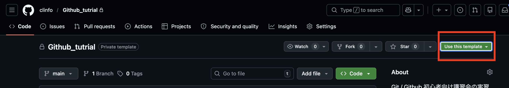
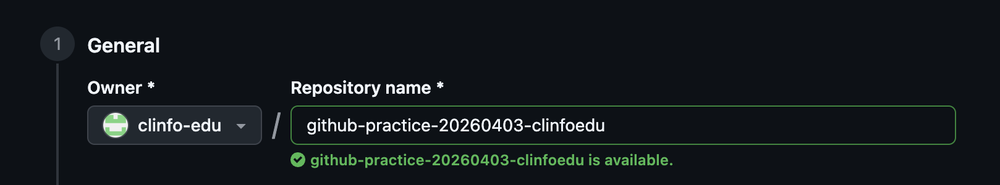
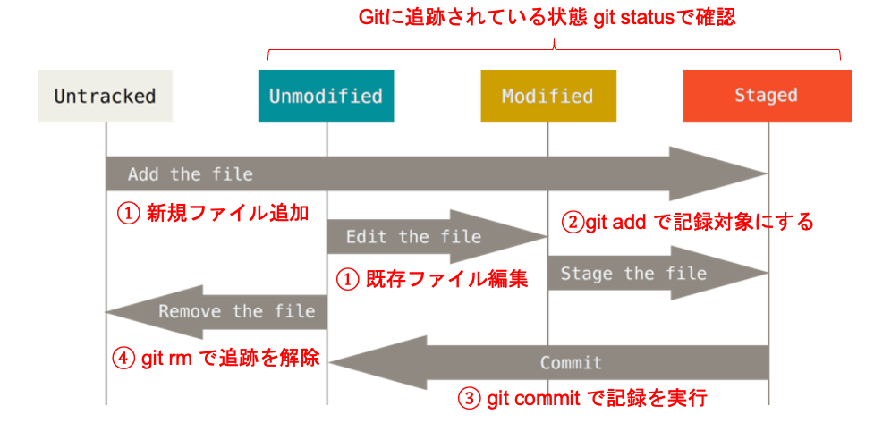
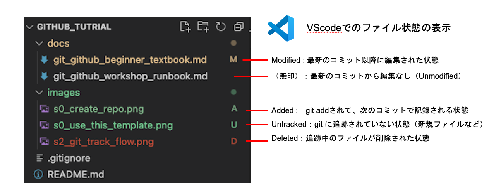
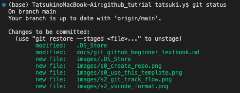

# Git / GitHub 入門講習

## この教材について
この講習では、GitおよびGitHubの基本的な利用方法を、操作を実際に試しながら学びます。  

具体的には、次の3点を順に達成することが目的です。

1. Git とは何か、GitHub とは何かを区別して理解する
2. Git を用いた基本的なファイル変更の記録フローに慣れる
3. 自分のリポジトリを安全に保守運用できるようになる

特に、Git基本コマンドである、`clone`, `status`, `add`, `commit`, `push`, `branch`, `pull`, `request`,`merge` を一通り練習します。    
最終的には、研究コードや論文投稿用コードを GitHub で適切に管理する全体像まで見通せる状態を目指します。

---

## 目次

- [1章 Git / GitHubとは何か](#1章-git--githubとは何か)
  - [1.1 Git とは何か](#11-git-とは何か)
  - [1.2 GitHub とは何か](#12-github-とは何か)
  - [1.3 Git と GitHub の違い](#13-git-と-github-の違い)
  - [実習 1-1](#実習-1-1)
- [2章 Gitが管理しているもの](#2章-gitが管理しているもの)
  - [2.1 リポジトリとは何か](#21-リポジトリとは何か)
  - [2.2 Git が追跡するファイル状態](#22-git-が追跡するファイル状態)
  - [2.3 `git status` とは何か](#23-git-status-とは何か)
  - [2.4 `.gitignore` とは何か](#24-gitignore-とは何か)
  - [実習 2-1](#実習-2-1)
  - [実習 2-2](#実習-2-2)
  - [実習 2-3](#実習2-3)
- [3章 最低限の基本操作](#3章-最低限の基本操作)
  - [3.1 `git add`](#31-git-add-復習)
  - [3.2 `git commit`](#32-git-commit復習)
  - [3.3 `git push`](#33-git-push)
  - [3.4 `git pull`](#34-git-pull)
  - [実習 3-1](#実習-3-1)
  - [実習 3-2](#実習-3-2)
  - [実習 3-3](#実習-3-3)
  - [実習 3-4](#実習3-4)
- [4章 個人運用の標準フロー](#4章-個人運用の標準フロー)
  - [4.1 なぜ branch を切るのか](#41-なぜ-branch-を切るのか)
  - [4.2 個人運用で身につけたい流れ](#42-個人運用で身につけたい流れ一例)
  - [実習 4-1](#実習-4-1)
  - [実習 4-2](#実習4-2)
  - [実習 4-3](#実習4-3)
  - [実習 4-4](#実習4-4)
- [5章 研究・論文執筆に向けた運用](#5章-研究論文執筆に向けた運用)
  - [5.1 研究で GitHub を使う意味](#51-研究で-github-を使う意味)
  - [5.2 研究用リポジトリで最低限そろえたいもの](#52-研究用リポジトリで最低限そろえたいもの)
  - [5.3 公開してはいけないもの](#53-公開してはいけないもの)
- [補足1 初心者のやりがちなミス](#補足1-初心者のやりがちなミス)
  - [1. `git status` を見ないまま進める](#1-git-status-を見ないまま進める)
  - [2. add し忘れる](#2-add-し忘れる)
  - [3. branch を間違える](#3-branch-を間違える)
  - [4. push できない](#4-push-できない)
  - [5. 余計なファイルを追跡してしまう](#5-余計なファイルを追跡してしまう)
- [補足2 発展操作](#補足2-発展操作)
  - [2.1 `git rebase`](#21-git-rebase)
  - [2.2 `git reset`](#22-git-reset)
  - [2.3 `git revert`](#23-git-revert)
  - [2.4 `git stash`](#24-git-stash)
- [補足3 fork / upstream / 外部リポジトリへの貢献](#補足3-fork--upstream--外部リポジトリへの貢献)
- [補足4 GitHub におけるリポジトリ権限](#補足4-github-におけるリポジトリ権限)
- [補足5 LICENSE ファイル](#補足5-license-ファイル)
- [補足6 README とは何か](#補足6-readme-とは何か)
- [補足7 一般的なリポジトリのディレクトリ構成](#補足7-一般的なリポジトリのディレクトリ構成)
- [補足8 zip展開からのGitHubリポジトリ作成方法](#補足8-zip展開からのgithubリポジトリ作成方法)

---

## 1章 Git / GitHubとは何か

### 1.1 Git とは何か
Git は、**ファイルの変更履歴を管理するための仕組み**です。  
特に、ソースコード、設定ファイル、原稿、図表生成スクリプトのように、少しずつ更新していくファイルの管理に向いています。

Git を使うと、たとえば次のことができるようになります。

- いつ、どのような変更を加えたのかを記録する (`commit`)
- 過去の状態に戻って確認する
- 開発用の分岐を作成して安全に開発・検証を実施する (`branch`)
- 他人の変更と自分の変更を統合する (`merge`)

### 1.2 GitHub とは何か
GitHub は、Git で管理している内容をネット上で共有し、共同作業しやすくするためのサービスです。  
Git そのものは履歴管理の仕組みですが、GitHub は **Git を使った共同運用の場**となります。

GitHub を使うと、たとえば次のことができます。

- リモートリポジトリを置く
- Pull Request (PR) を作る
- コードレビューを依頼する
- issue で課題を管理する
- README や LICENSE を公開する

### 1.3 Git と GitHub の違い
混同しやすいですが、役割は分けて考えると理解しやすくなります。

| 項目 | Git | GitHub |
|---|---|---|
| 役割 | 変更履歴を管理する仕組み | Git を使った共有・共同作業の場 |
| 主な対象 | ローカルでの履歴管理 | リモートでの共同運用 |
| 機能例 | `commit`, `branch`, `merge` | `Pull Request`, `review`, `issue` |

### 実習 1-1
**個人練習用リポジトリ**を準備してみましょう。  
練習用テンプレートを、自分の GitHub アカウントに複製します。

#### 手順
1. ブラウザで[練習用テンプレートリポジトリ]()を開き、**Use this template** を押してみましょう

2. Owner は **自分のアカウント名**、リポジトリ名は、`github-practice-<日付(yyyymmdd)>-<氏名>` として、**Create repository** を押してみましょう


#### 何をしているのか
テンプレートとなるGitHubリポジトリから、自分専用の練習リポジトリを新しく作成しています。  **リポジトリ**とは何かについては、2章で説明します。  

#### 正しく実行できているか確認
次の状態になっていれば成功です。

- 自分の GitHub アカウント配下に新しいリポジトリができている
- README や練習用ファイルが最初から入っている
- URL が `https://github.com/<自分のアカウント名>/<自分のリポジトリ名>` になっている

---

## 2章 Gitが管理しているもの

### 2.1 リポジトリとは何か
リポジトリは、プロジェクトのファイルと履歴をまとめて管理する単位です。  
- **ローカルリポジトリ**：自分の手元PC（ローカル環境）に置くリポジトリ。
- **リモートリポジトリ**：インターネット上あるいはそこに接続されたサーバーに置かれるリポジトリ。**GitHubリポジトリ**が代表的。

リポジトリを簡単な言葉で表すと、 **「Gitにより変更履歴が管理されているディレクトリ」** です。Gitは、ディレクトリ中のファイルの変更履歴を `.git` という隠しフォルダ中に記録することで、ディレクトリの変更履歴全体を管理しています。

### 2.2 Git が追跡するファイル状態

Git では、ファイルが今どの状態にあるかを見ながら操作を進めます。  
特に、次の4つを区別してみましょう。

1. Untracked  
まだ Git に追跡されていないファイルです。新しく作成したファイルなどがこの状態になります。

2. Unmodified   
Git に追跡されていて、前回の commit から変更されていない状態です。

3. Modified   
Git に追跡されているファイルを編集し、まだ add していない状態です。

4. Staged   
次の commit に入れたい変更として選ばれた状態です。`git add` を実行すると、この状態になります。

もう少し具体的な流れで説明します。今、あなたはすでにGitが有効なリポジトリで作業しているとします。下の図を見てください。



- （図①）新規ファイルを追加した場合、そのファイルは `Untracked` となり、Gitに追跡されていません。また、既存のファイル（`Unmodified`）を編集した場合、`Modified`となります。

- （図②）新規ファイルや編集したファイルの変更履歴を記録 (commit) するために、`git add` でファイルをステージします（`Staged`）。ステージするとは、次の commit に入れたい変更内容を、ステージングエリアに登録することです。

- （図③）ステージされた変更を `git commit` でまとめて履歴として記録します。変更が記録されたファイルは再び `Unmodified` の状態になります。

- （図④）既にGitに追跡されているファイルを追跡解除する場合は、`git rm` を使用します。

重要なのは、編集しただけではまだ commit されないということです。
ファイルを編集すると `Modified` になり、`git add` を実行すると `Staged` になります。
その後に `git commit` を実行して、はじめてその変更が履歴として記録されます。

これらのファイル状態は次節の `git status` を使用するか、VScode上では各ファイルの横の装飾を見れば大体わかります。下図で確認しましょう。




### 2.3 `git status` とは何か
`git status` は、リポジトリやブランチ、各ファイルの状態を確認するコマンドです（ブランチについては後で説明します）。  



例えば上のような結果だった場合、次のようなことが分かります。

- `main` ブランチで作業しています

- 変更はすでに commit 対象として選ばれています（緑色の部分）

- 変更には「修正したファイル（modified）」と「新しく追加したファイル（new file）」があります

初心者のうちは、迷ったらまず `git status` を見る癖をつけてみましょう。

### 2.4 `.gitignore` とは何か
`.gitignore` は、Git に追跡させたくないファイルを指定するためのファイルです。  
たとえば、次のようなものは追跡しないことが多くなります。

- 実行して自動生成された一時ファイル
- 大きな中間生成物
- 個人設定ファイル
- 秘密情報を含むファイル
- 生データ

注意点として、すでにGitに追跡されているファイルを持続的に追跡解除したい場合、単に ignore に追記するだけでは解除できません。まず、`git rm --cached` （**`--cached` なしだとファイル自体も削除されるので注意**）で現在の追跡から解除して、その後 ignore に追記して今後の追跡対象からも除外するようにしましょう。

### 実習 2-1

#### 手順
自分の個人練習用リポジトリを手元に取り込み、ファイル状態の変化を見てみましょう。  
次のコマンドを「ターミナル」などのCLIで実行してください。

```bash
# GitHubリポジトリをコピーする
git clone https://github.com/<your_github_account>/<your_github_practice_repo_name>.git 

# コピーしたディレクトリに移動する
cd <your_github_practice_repo_name>

# 現在の状態を確認する
git status 
```

#### 確認するべきこと
- リポジトリのディレクトリが作成されている
- `git status` を実行すると、現在の branch 名と作業状態が表示される
- まだ何も変更していなければ、作業ツリーがきれいだと分かる表示になっている

※補足：作業ツリー   
手元で開いて編集している実際のファイル群。ファイルを編集した場合、コミットされたわけでもなく、ステージされたわけでもなく、まずは作業ツリーに変更が置かれる。 その後、`git add` して初めて変更がステージされる。

### 実習 2-2
ファイルを少し編集して、`git status` の表示がどう変わるか見てみましょう
`docs/practice_note.md` を開き、1行だけ追記して保存しましょう。   
その後、再度 `git status` を実行してみましょう。

```bash
# ファイルを編集した直後の状態を確認する
git status 
```
この時、まだ変更は commit されていないことに注意してください。

#### 確認するべきこと
- `modified:` のような表示が出る
- 変更したファイル名が表示される
- 「まだ commit はされていない」状態だと分かる

### 実習 2-3
さらに、`.gitignore` を見てみましょう。

```bash
cat .gitignore # 追跡対象から外す設定を確認しています。
```

無視するファイルやディレクトリの記載が確認できるはずです。

---

## 3章 最低限の基本操作

この章では、2章の説明内容を復習しつつ、実際にファイルの変更履歴を記録し、GitHubリポジトリに反映させる最小限の流れを説明します。  
つまり、`git add → git commit → git push` の流れを学びます。

### 3.1 `git add`
`git add` は、「次の commit にどの変更を入れるか」を選ぶ操作です。  
リポジトリのルートで`git add .` を実行すると、すべての追跡対象ファイルの変更履歴が記録対象に入ります。

### 3.2 `git commit`
`git commit` は、選ばれた変更を1つの履歴として記録する操作です。  
コミットメッセージには、「何を変えたか」だけでなく、「なぜその変更をしたか」も少し分かるように書くと良いでしょう。

### 3.3 `git push`
`git push` は、ローカルリポジトリで作った commit を GitHubリポジトリへ反映させる操作です。  
**これをしないと、GitHub 上には変更が反映されません。**

### 3.4 `git pull`
`git pull` は、GitHub 上で増えた変更をローカルに取り込む操作です。  
共同作業では、作業開始前や merge 後に実行する場面がよくあります。

### 実習 3-1
ここでは、ローカルでの1つの変更を `add → commit → push` でGitHub側に反映させてみましょう。    
まず、2章で編集したファイル (`docs/practice_note.md`) を commit 対象に入れてみましょう。

```bash
# git add で、指定したファイルをステージする
git add docs/practice_note.md

# git status で、ファイル追跡状態の変化を確認する
git status
```

#### 確認するべきこと
- `Changes to be committed:` のような表示が出る
- 追加したファイルが commit 対象に入っている

### 実習 3-2
次に、commit を実行することで、変更内容を記録してみましょう。

```bash
# git commit で、ステージした変更内容全体を1つの履歴として記録する
git commit -m "Update practice note" # コミットメッセージは適宜変えましょう。
```

#### 確認するべきこと
- commit が作成されたことを示す表示が出る
- 変更ファイル数や変更行数が表示される

### 極めて重要なポイント
ここまでのファイル更新と変更内容の記録は、すべてローカルリポジトリで実施されています。  
リモートリポジトリに対する操作を行っていないため、 GitHub 側には何も反映されていません。

### 実習 3-3
変更履歴を GitHub 側へ反映してみましょう。

```bash
# git push で、ローカルリポジトリで作った commit を GitHubリポジトリへ反映させる
git push origin main
```

#### 何をしているのか
ローカルの `main` ブランチにある commit を、GitHub 上の `origin` というリモートリポジトリへ送っています。

#### 確認するべきこと
- エラーなく push が完了する
- GitHub のブラウザ画面を更新すると、変更が反映されている

#### 補足

- `origin` はリモートリポジトリの登録名（`git remote -v` などで一覧を確認できる）。

- `git push origin main` は、 `git push origin main:main` の省略形。コロン以下を省略した場合、コロン以前のブランチと同じ名前の origin ブランチに自動的に送られるようになっている。

- 実は、`git clone` も `git push` も、GitHubリポジトリ以外のリポジトリ間で使用することができる（ちょっと難しい）。

### 実習 3-4

実習3-3までで、ローカルでの変更をリモートに反映しました。   
次は逆に、リモートでの変更をローカルに反映する方法も見てみましょう（共同開発で他の人の追加実装を自分のリポジトリにも反映させるような場面）。  
ここではそのデモとして、GitHub 上で `main` に変更を加えたあと、ローカルへ取り込んでみましょう。

#### 手順
1. GitHub上で `docs/practice_note.md`　を開く
2. 「Edit this file」をクリックして、任意の編集を行う
3. 「Commit changes」をクリックして commit する
4. GitHubリポジトリ上でコミットが追加されたことを確認する
5. 次のコマンドを実行してGitHubリポジトリ側のコミットをローカルリポジトリに記録する

```bash
# git pull で、GitHub（リモート）で増えた変更をローカルに取り込む
git pull origin main
```

#### 確認するべきこと
取り込まれた変更の内容が表示される

---

## 4章 個人運用の標準フロー

3章では、ファイルを編集し、git add、git commit、git push を使って変更を記録し、GitHub に反映する基本的な流れを確認しました。  
しかし、実際の開発では、すでに安定して動いている状態を保ちながら、別の作業を進めたい場面が多くあります。たとえば、バグ修正、新機能の追加、説明文の更新などです。

そのようなときに使うのが **branch** です。  
branch を使うと、安定版の履歴とは分けて、作業中の変更を安全に進められます。

この章では、branch の役割と基本的な使い方を学び、個人で Git を使うときの標準的な流れを理解していきましょう。

### 4.1 なぜ branch を切るのか

branch を切ると、安定している状態と、いま試している変更を分けて管理できます。   
そのため、途中まで作業した変更があっても、安定版である `main` をすぐに不安定な状態にせずに済みます。

個人運用では、必ずしも毎回 branch を使わなくても作業できることはあります。    
ただし、個人リポジトリでも branch を使う習慣をつけておくと、作業単位ごとに履歴を整理しやすくなり、あとから見直すときにも分かりやすくなります。

### 4.2 個人運用で身につけたい流れ（一例）
個人リポジトリでは、次の流れを標準にしてみましょう。

1. `main` を最新化する （最新の安定版を土台に作業するために必要！）
2. 作業用 branch を作る
3. 変更する
4. commit する
5. GitHub に push する
6. Pull Request を作る
7. 内容を確認して merge する
8. `main` をもう一度最新化する

### 実習 4-1
自分の個人練習用リポジトリ内で branch を切り、Pull Request を作って merge してみましょう。

```bash
# main に切り替える
git switch main

# main を最新化する
git pull origin main

# 最新化した main を土台とする作業用 branch を作成して移動する
git switch -c feature-add-self-intro
```

#### 確認するべきこと
- branch 名が `feature-add-self-intro` に変わる
- `git status` で現在の branch が確認できる

#### 補足：`git checkout` 
`git switch` の代わりに、 `git checkout -b` でも同じ操作ができます。  
ただし、この教材では、branch の切り替え専用コマンドである `git switch` の方が意味を理解しやすいため、`git switch -c` を使用しています。

### 実習4-2
次に、作業用 branch でファイルを1つ更新してみましょう。  
`docs/<your_name>.md` を新規作成して、自分の名前を記載しましょう。  
その後、以下のコマンドで変更を記録し、GitHubに反映しましょう。

```bash
# 復習：git add で、指定したファイルをステージする
git add docs/<your_name>.md

# 復習：git commit で、ステージした変更内容全体を1つの履歴として記録する
git commit -m "Add self introduction"

# git push で、ローカルリポジトリで作った commit を GitHubリポジトリへ反映させる
git push -u origin feature-add-self-intro
```

#### 確認するべきこと
- GitHub 上に `feature-add-self-intro` が作成される
- そのブランチ上で先ほどのファイルが見える

#### 補足： `git push -u` について

- `-u` は、現在のローカル branch `feature-add-self-intro` が、リモート `origin` 上の `feature-add-self-intro` と対応していることを登録します
- これにより、次回からは `git push` や `git pull` のたびに branch 名を毎回明示しなくてもよくなります

### 実習4-3
実習4-2では、作業用 branch `feature-add-self-intro` の変更を GitHub に push しました。    
ただし、この時点では、変更はまだ安定版である `main` には反映されていません。

これは、作業中の変更をいきなり `main` に統合せず、内容を確認してから反映できるようにするためです。    
実際の開発では、変更内容や差分を確認せずに `main` を更新すると、不整合や意図しない変更が入りやすくなります。

GitHub には、そのような事故を防ぎながら branch を統合するための仕組みとして、**Pull Request** があります。    
Pull Request を使うと、`main` を直接書き換える前に、変更内容、コミット、差分を確認してから統合できます。

ここでは、GitHub 上で `feature-add-self-intro` から `main` への Pull Request を作成し、内容を確認したうえで merge してみましょう。

#### 手順
1. 自分の個人リポジトリをブラウザで開いてみましょう
2. `feature-add-self-intro` から `main` への Pull Request を作ってみましょう
3. タイトルと本文を簡潔に書いてみましょう
4. 差分を確認してみましょう
5. 問題がなければ merge してみましょう

#### 確認するべきこと
- Pull Request が作成される
- Files changed で変更箇所が見える
- merge 後、`main` に変更が入る

### 実習4-4
ここまでで、GitHub 上では Pull Request の merge が完了し、`main` に変更が統合されました。   
ただし、この時点では、ローカルの `main` にはまだその変更が反映されていません。

ローカルの `main` を GitHub 上の最新状態にそろえるには、リモートの変更を取り込む必要があります。    
最後に、GitHub 上で merge 済みの内容をローカルに取り込み、ローカル `main` を最新化してみましょう。

GitHub 側で反映された変更が、ローカルの `main` にも反映されるはずです。

#### コマンド

```bash
# 復習： git switch で、ブランチを切り替える
git switch main

# git pull で、GitHub（リモート）で増えた変更をローカルに取り込む
git pull origin main
```

#### 確認するべきこと
- merge した内容がローカルにも入る
- `git status` がきれいな状態になる

---

## 5章 研究・論文執筆に向けた運用

### 5.1 研究で GitHub を使う意味
研究では、コードが動くことだけでなく、「どの版でその結果が出たのか」を後から説明できることが重要になります。  
Git と GitHub を使うと、次の点が整理しやすくなります。

- どの解析スクリプトを使ったか
- どの設定で実験したか
- どの時点で図表を作ったか
- 共同著者がどこを更新したか
- 公開してよいものと公開してはいけないもの

### 5.2 研究用リポジトリで最低限そろえたいもの
研究用リポジトリでは、少なくとも次のものを整理しておくと、後から自分でも助かります。

- README
- 実行手順
- 依存ライブラリ情報
- 設定ファイル
- スクリプトの役割が分かるディレクトリ構成
- `.gitignore`

### 5.3 公開してはいけないもの
次のようなものは、そのまま push しないように注意してみましょう。

- 生データ
- 個人情報を含むファイル
- API キーや秘密鍵
- 大きな中間生成物
- ローカル環境依存の設定ファイル

---

## 補足1 初心者のやりがちなミス

### 1. `git status` を見ないまま進める
ファイルの状態は随時確認するべきです。  
迷ったら、まず `git status` を実行してみましょう。

### 2. add し忘れる
ファイルを編集しただけでは commit されません。  
`modified` のままになっていないか確認してみましょう。

### 3. branch を間違える
共有リポジトリで `main` のまま作業しないように注意してみましょう。  
作業前に現在の branch を確認してみましょう。

### 4. push できない
自分より先に誰かが更新していると、いきなり push できないことがあります。  
その場合は、まず `git pull` の必要性を確認してみましょう。

### 5. 余計なファイルを追跡してしまう
ログや生成物まで commit しないように、`.gitignore` を整えてみましょう。

---

## 補足2 発展操作

### 2.1 `git rebase`
履歴を一直線に整えたいときに使います。  
ただし、公開済み branch の履歴を書き換える場面では注意が必要になります。

### 2.2 `git reset`
commit や staging の状態を戻したいときに使います。  
`--soft` `--mixed` `--hard` の違いを理解してから使ってみましょう。

### 2.3 `git revert`
過去の commit を打ち消す新しい commit を作りたいときに使います。  
履歴を残したまま取り消したいときに向いています。

### 2.4 `git stash`
作業途中の変更を一時退避したいときに使います。  
branch を切り替えたいのに、まだ commit したくない場面で便利になります。

---

## 補足3 fork / upstream / 外部リポジトリへの貢献

fork は、書き込み権限のない外部リポジトリへ変更提案したいときに使う流れです。  
この講習の個人運用練習では、理解を簡単にするため template repository を使いました。  
一方で、公開 OSS に貢献するときは、fork と upstream の考え方が必要になります。

- **fork**  
  他人のリポジトリを自分のアカウント側へ複製します
- **upstream**  
  元になった本家リポジトリを指します

この講習で実施した個人練習では、fork の代わりに template を使って練習負荷を意図的に下げました。

---

## 補足4 GitHub におけるリポジトリ権限

GitHub の organization repository では、一般に次のような権限が使われます。

- **Read**  
  読み取り中心です
- **Triage**  
  issue や Pull Request の整理をしやすくします
- **Write**  
  push や branch 作成、Pull Request 作成などを行えます
- **Maintain**  
  管理寄りの作業を行えます
- **Admin**  
  repository の完全管理を行えます

---

## 補足5 LICENSE ファイル

LICENSE は、このリポジトリの内容を他の人がどの条件で使ってよいかを明示するためのファイルです。  
公開リポジトリでも、LICENSE がない場合は「自由に使ってよい」とは限りません。

よく見かけるものとして、次のような種類があります。

- **MIT License**  
  比較的シンプルで使いやすい形です
- **Apache License 2.0**  
  特許に関する条項も含みます
- **GPLv3**  
  改変物の公開条件を強めに保ちたいときに選ばれます
- **BSD系**  
  比較的緩やかな条件で使われます

非公開リポジトリでは LICENSE をすぐに決めないこともありますが、論文投稿や学会発表で公開を考える段階では検討しましょう。

---

## 補足6 README とは何か

README は、リポジトリの入口になる説明文です。  
GitHub では、トップページでまず README が目に入ることが多くなります。

最低限、次の内容を書いておくと分かりやすくなります。

- このリポジトリが何をするものか
- どのようなデータやコードを含むか
- どう実行するか
- 依存関係は何か
- 連絡先や保守担当は誰か

---

## 補足7 一般的なリポジトリのディレクトリ構成

次のような構成がよく使われます。

- `src/`  
  主なソースコードを置きます
- `config/`  
  設定ファイルを置きます
- `scripts/`  
  実行用スクリプトを置きます
- `data/`  
  データ関連を置きます  
  ただし、生データの扱いは慎重にしましょう
- `docs/`  
  文書や補足説明を置きます
- `tests/`  
  テストコードを置きます
- `notebooks/`  
  解析に使用した notebook を置きます

---

## 補足8 zip展開からのGitHubリポジトリ作成方法

zip形式で `README` / `src` / `config` / `*.yaml` まで一式そろっているコードを、GitHubの新規リポジトリとして登録する場合、以下のようにできます。

```
# 1) zipを展開
unzip your_code_package.zip
cd your_code_package

# 2) Git初期化
git init

# 3) GitHubで「空の新規リポジトリ」を作成（注意： ライセンス & READMEは作らない）
#   例: https://github.com/your-org/your-repo.git

# 4) リモート登録
git remote add origin https://github.com/your-org/your-repo.git

# 5) 追加・コミット・push
git add .
git commit -m "Initial commit"
git branch -M main
git push -u origin main
```
